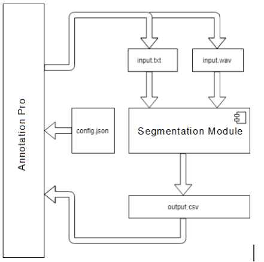
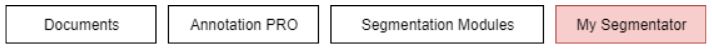
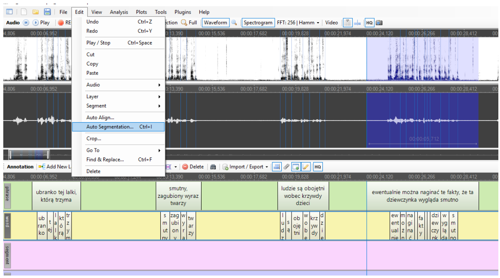
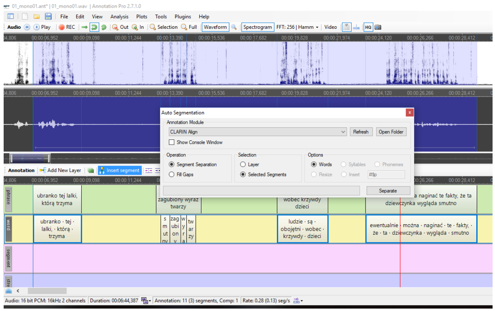
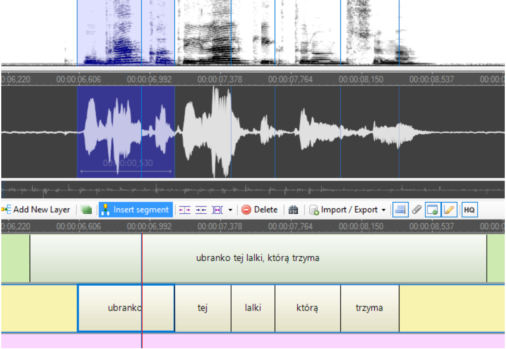

# Clarin-PL speech tools plugin for AnnotationPro

This page contains the plugin for [Annotation Pro](http://annotationpro.org/). You can download the file below and install it using the instructions below. Inside the archive you will also find the `vc_redist.x64.exe` setup that needs to be installed on the machine that the tool is to be used on.

[Download the archive here](https://github.com/CLARIN-PL/speech-annotationpro-plugin/releases/download/v1.0/CLARIN_Align.zip)

Annotation Pro includes the ability to add a custom automatic segmentation module provided by the user. This adds the option to use a personal tool within Annotation Pro, thus allowing the user to perform automatic segmentation of personal data collections on multiple levels of annotation. The ability to work in a desktop environment can often be more effective, especially with longer audio or video file or in he presence of lots of noise in the data. Such a tool allows for a tighter supervision of the process. Using the tool offline also allows for the annotation of sensitive data, which cannot be transmitted to external servers.

To install a module, it needs to be placed in the Documents -> Annotation Pro -> Segmentation Modules folder. The name of the folder containg the module will be used as the name of the tool within the Annotation Pro interface.

In the example below, the name will be My Segmentator. After placing the module in the correct folder the segmentation option will be made available under the Auto Segmentation menu option:

The user chooses the module from the list (there can be several such modules at the same time) - here, for example, we choose the CLARIN Align module:

Sample segmentation result:

